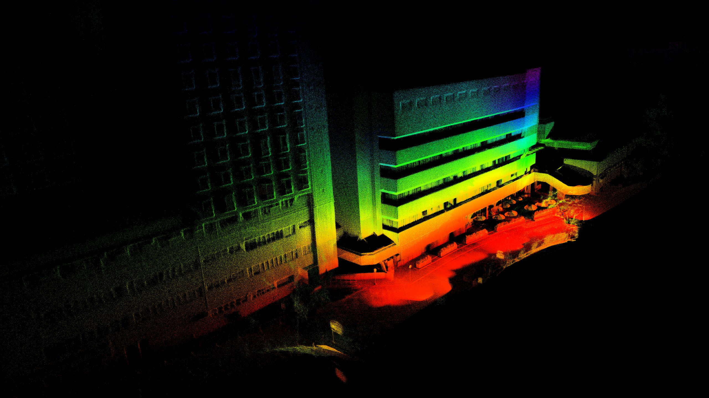
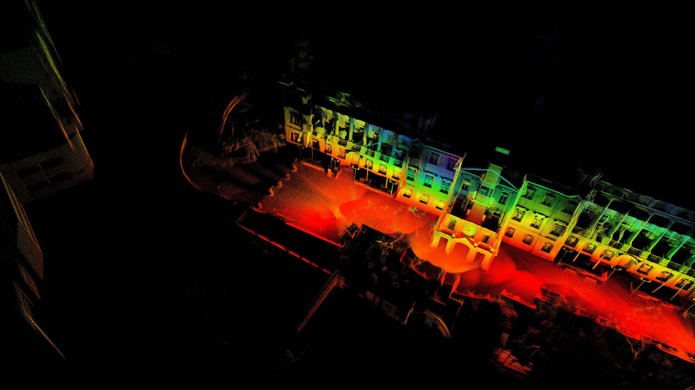
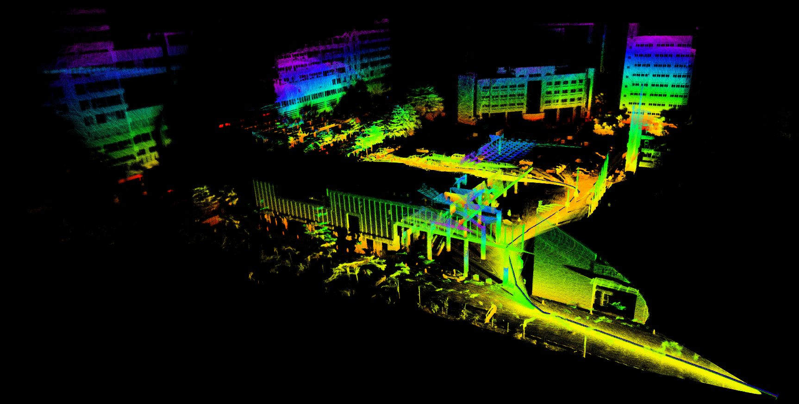
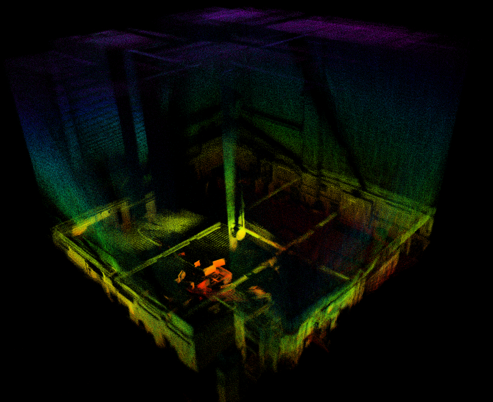

## LIKE_LOAM
LIKE_LOAM (Lidar-inertial Iterative Kalam Estimator) is a real-time tightly coupled lidar-initial SLAM package for LiDAR odometry and mapping. (It has been tested in Livox Avia Lidar and will support some other Lidar platforms in the future)

<div align="center">
    
    
</div>

Some key issues:
1. Real-time tightly-coupled LiDAR-IMU Fusion;
2. Directly odometry by mapping;
3. Robust feature extraction.

## 1. Prerequisites
### 1.1 **Ubuntu** and **ROS**
Ubuntu 64-bit 18.04.
ROS Melodic. [ROS Installation](http://wiki.ros.org/ROS/Installation)

### 1.2. **PCL && Eigen && openCV**
Follow [PCL Installation](http://www.pointclouds.org/downloads/linux.html).
Follow [Eigen Installation](http://eigen.tuxfamily.org/index.php?title=Main_Page).
Follow [openCV Installation](https://opencv.org/releases/).

### 1.3. **livox_ros_driver**
Follow [livox_ros_driver Installation](https://github.com/Livox-SDK/livox_ros_driver).


## 2. Build
Clone the repository and catkin_make:

```
    cd ~/catkin_ws/src
    git clone https://github.com/XW-HKU/LIKE_LOAM.git
    cd ..
    catkin_make
    source devel/setup.bash
```

*Remarks:*
- If you want to save the pcd file please add map_file_path in launch file.
## 3. Directly run
### 3.1 For outdoor environments
Connect to your PC to Livox Avia LiDAR following [Livox-ros-driver installation](https://github.com/Livox-SDK/livox_ros_driver), then
```
    ....
    roslaunch like_loam mapping_avia_outdoor.launch
    roslaunch livox_ros_driver livox_lidar_msg.launch
    
```
### 3.2 For indoor environments
Connect to your PC to Livox Avia LiDAR by following  [Livox-ros-driver installation](https://github.com/Livox-SDK/livox_ros_driver), then
```
    ....
    roslaunch like_loam mapping_avia_indoor.launch
    roslaunch livox_ros_driver livox_lidar_msg.launch
    
```
## 4. Rosbag Example
### 4.1 Livox Avia outdoor rosbag

<div align="center"></div>

<!-- <div align="center"></div> -->

Download [avia_hku_main building_mapping](https://drive.google.com/file/d/1GSb9eLQuwqmgI3VWSB5ApEUhOCFG_Sv5/view?usp=sharing) and then
```
roslaunch like_loam mapping_avia_outdoor.launch
rosbag play YOUR_DOWNLOADED.bag
```
### 4.2 Livox Avia indoor rosbag

<div align="center"></div>

Download [avia_indoor_quick_shake_example1](https://drive.google.com/file/d/1SWmrwlUD5FlyA-bTr1rakIYx1GxS4xNl/view?usp=sharing) or [avia_indoor_quick_shake_example2](https://drive.google.com/file/d/1wD485CIbzZlNs4z8e20Dv2Q1q-7Gv_AT/view?usp=sharing) and then
```
roslaunch like_loam mapping_avia_indoor.launch
rosbag play YOUR_DOWNLOADED.bag
```

## 5.Acknowledgments
Thanks for LOAM(J. Zhang and S. Singh. LOAM: Lidar Odometry and Mapping in Real-time), [LOAM_NOTED](https://github.com/cuitaixiang/LOAM_NOTED), [Livox_Mapping](https://github.com/Livox-SDK/livox_mapping).
